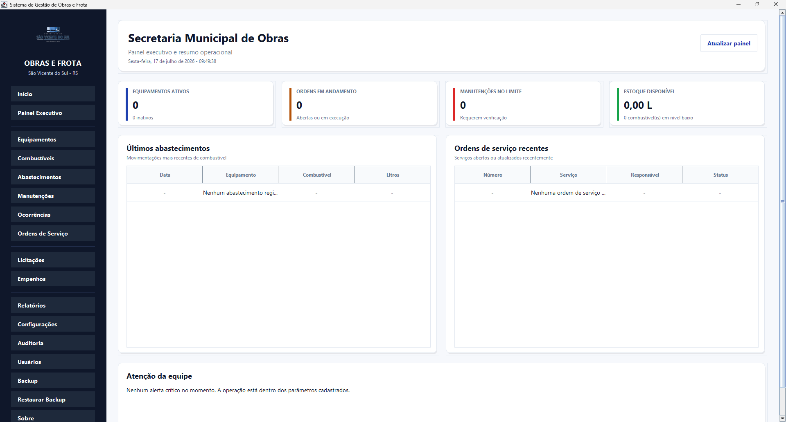
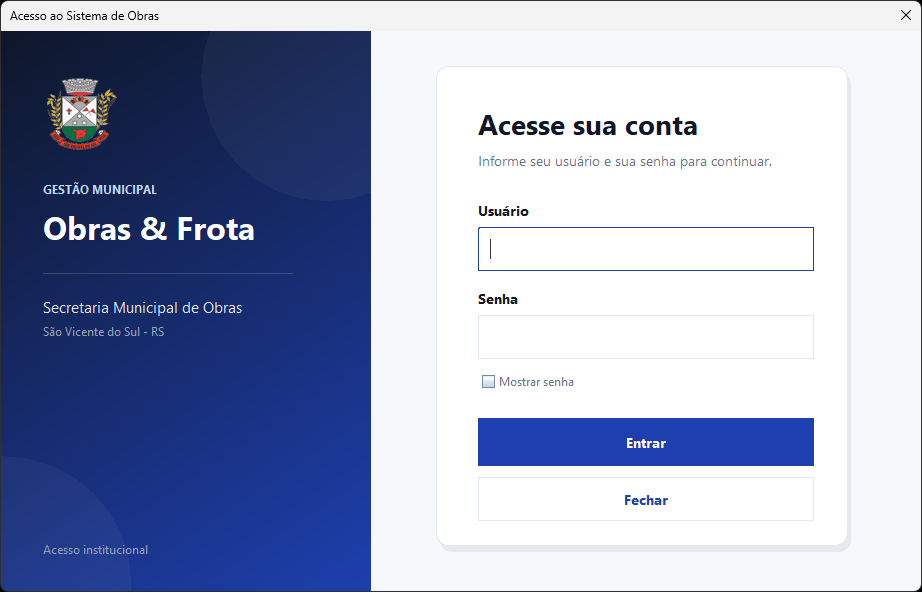
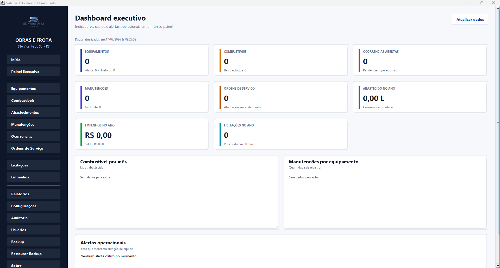
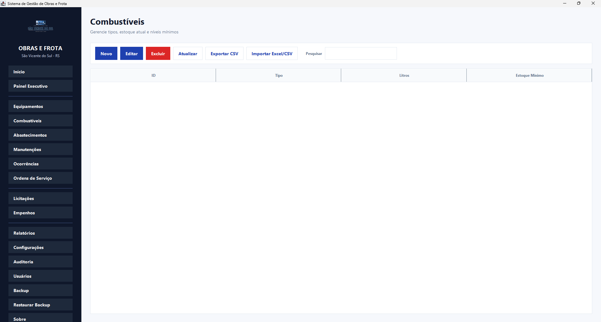
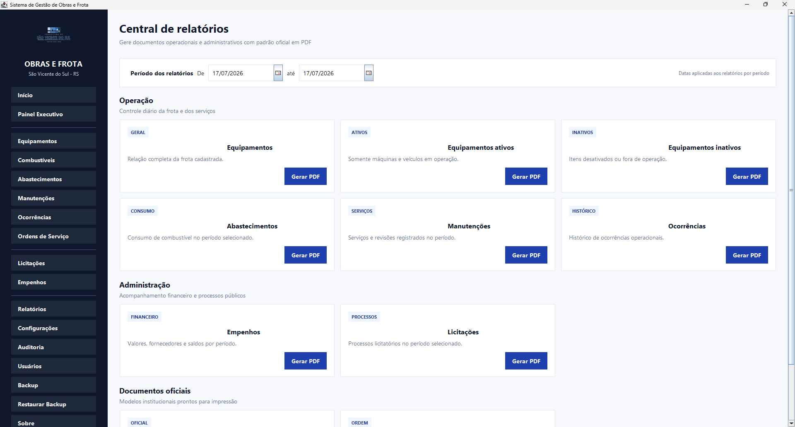
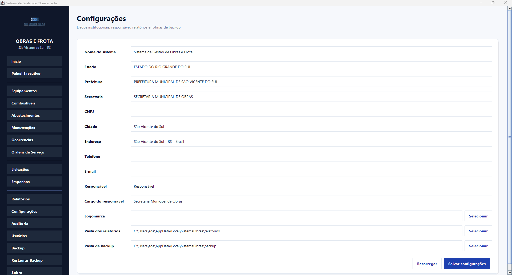
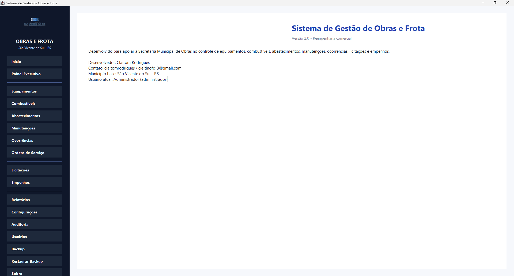

<div align="center">

# Sistema de Gestão de Obras e Frota

### Controle operacional, rastreabilidade e informação estratégica para a gestão pública municipal

[](https://www.java.com/)
[](https://www.sqlite.org/)
[](#)
[](#)

<br>



<br>

**Uma solução completa para centralizar a gestão de equipamentos, combustíveis, abastecimentos, manutenções, ordens de serviço, licitações, empenhos e relatórios da Secretaria Municipal de Obras.**

</div>

---

## Visão geral

O **Sistema de Gestão de Obras e Frota** foi desenvolvido para modernizar a rotina administrativa e operacional de secretarias municipais de obras.

A plataforma substitui controles dispersos, anotações manuais e planilhas isoladas por um ambiente único, seguro e organizado, permitindo acompanhar recursos, movimentações, custos, documentos e atividades com maior precisão.

O sistema foi projetado para funcionar localmente em computadores Windows, com banco de dados próprio, instalação simplificada e independência de conexão com a internet para as operações do dia a dia.

## Por que utilizar o sistema

- Centralização das informações em uma única plataforma.
- Redução de controles manuais e registros duplicados.
- Histórico completo de equipamentos e movimentações.
- Maior controle sobre gastos com combustível e manutenção.
- Acompanhamento de licitações, empenhos e ordens de serviço.
- Relatórios institucionais em PDF para prestação de contas.
- Indicadores executivos para apoiar decisões administrativas.
- Controle de usuários, perfis e permissões por módulo.
- Backup e restauração dos dados da aplicação.

---

## Principais módulos

### Gestão de equipamentos

Cadastro e acompanhamento da frota e dos equipamentos municipais, incluindo identificação, tipo, placa, quilometragem, horas de uso, situação e histórico operacional.

### Controle de combustíveis

Gerenciamento dos tipos de combustível, estoque disponível, estoque mínimo e alertas operacionais.

### Abastecimentos

Registro dos abastecimentos realizados, relacionando equipamento, combustível, quantidade e data da operação.

### Manutenções

Controle de manutenções preventivas e corretivas, com descrição, data, equipamento vinculado e valor do serviço.

### Ocorrências

Registro de problemas, avarias e fatos relevantes relacionados aos equipamentos e às atividades da secretaria.

### Ordens de serviço

Organização das demandas operacionais, responsáveis, prazos, prioridades e situação de cada serviço.

### Licitações e empenhos

Acompanhamento de processos administrativos, empresas, valores, modalidades, objetos, datas e vínculos financeiros.

### Relatórios

Central de documentos com geração de relatórios em PDF para equipamentos, abastecimentos, manutenções, ocorrências, licitações e empenhos.

### Usuários, auditoria e permissões

Gerenciamento de usuários por perfil, permissões específicas por módulo e registro das ações realizadas no sistema.

### Backup e restauração

Criação de cópias de segurança manuais e automáticas, com opção de restauração do banco de dados.

---

## Interface do sistema

### Acesso institucional

Tela de autenticação projetada para oferecer uma entrada segura, clara e alinhada à identidade visual da instituição.

<div align="center">
  
</div>

### Painel inicial

Visão operacional com informações rápidas sobre equipamentos, ordens de serviço, abastecimentos e alertas da equipe.

<div align="center">
  
</div>

### Dashboard executivo

Indicadores consolidados para acompanhamento da frota, consumo de combustível, custos de manutenção, ordens de serviço, licitações e alertas operacionais.

<div align="center">
  
</div>

### Gestão de equipamentos e combustíveis

<table>
  <tr>
    <td width="50%" align="center">
      <strong>Equipamentos</strong><br><br>
      
    </td>
    <td width="50%" align="center">
      <strong>Combustíveis</strong><br><br>
      
    </td>
  </tr>
</table>

### Relatórios e configurações

<table>
  <tr>
    <td width="50%" align="center">
      <strong>Central de relatórios</strong><br><br>
      
    </td>
    <td width="50%" align="center">
      <strong>Configurações institucionais</strong><br><br>
      
    </td>
  </tr>
</table>

### Informações do produto

<div align="center">
  
</div>

---

## Recursos profissionais

### Segurança e controle de acesso

- Autenticação de usuários.
- Senhas protegidas com SHA-256 e salt individual.
- Perfis de administrador, secretário, operador e visualizador.
- Permissões por módulo e por ação.
- Registro de operações em auditoria.
- Sessão de usuário controlada durante a utilização.

### Relatórios institucionais

- Geração de documentos em PDF.
- Cabeçalho institucional configurável.
- Identificação do município e da secretaria.
- Filtros por período.
- Relatórios prontos para impressão e arquivamento.
- Armazenamento organizado em diretório próprio da aplicação.

### Importação e exportação

- Importação de dados por planilhas Excel.
- Exportação de tabelas para Excel e CSV.
- Pesquisa e filtragem de registros.
- Histórico detalhado por equipamento.

### Proteção dos dados

Os arquivos operacionais são armazenados no perfil local do usuário, evitando problemas de permissão na pasta de instalação:

```text
%LOCALAPPDATA%\SistemaObras\
├── sistema.db
├── backup\
└── relatorios\
```

---

## Tecnologias utilizadas

| Tecnologia | Aplicação |
|---|---|
| Java 21 | Linguagem principal e execução da aplicação |
| Java Swing | Construção da interface desktop |
| FlatLaf | Aparência moderna dos componentes visuais |
| SQLite | Banco de dados local e portátil |
| JDBC | Comunicação entre a aplicação e o banco |
| OpenPDF | Geração dos relatórios em PDF |
| Apache POI | Leitura e importação de planilhas Excel |
| JCalendar | Seleção de datas nos formulários |
| jpackage | Geração do instalador nativo para Windows |

---

## Arquitetura do projeto

O sistema utiliza uma organização em camadas para facilitar manutenção, testes e evolução:

```text
src/
├── main/          Inicialização da aplicação
├── view/          Telas e componentes da interface
├── controller/    Comunicação entre interface e regras
├── service/       Regras de negócio
├── dao/           Acesso e persistência de dados
├── model/         Entidades do sistema
├── security/      Login, sessão e permissões
├── report/        Geração de documentos em PDF
├── backup/        Backup e restauração
├── dashboard/     Indicadores executivos
├── config/        Configurações e caminhos da aplicação
├── util/          Importação, exportação e utilitários
└── img/           Recursos visuais
```

---

## Instalação

A aplicação possui instalador nativo para Windows gerado com `jpackage`.

### Requisitos do computador do usuário

- Windows 10 ou Windows 11.
- Permissão para instalar aplicativos.
- Espaço disponível para o sistema e os backups.

A versão distribuída pelo instalador inclui o ambiente Java necessário. Portanto, o usuário final não precisa instalar ou configurar o Java manualmente.

### Processo de instalação

1. Execute o instalador do Sistema de Gestão de Obras e Frota.
2. Siga as etapas apresentadas na tela.
3. Abra o sistema pelo atalho criado no menu Iniciar ou na área de trabalho.
4. Entre com um usuário autorizado.
5. Configure os dados institucionais e o diretório de relatórios, quando necessário.

---

## Público-alvo

A solução é indicada para:

- Secretarias municipais de obras.
- Setores responsáveis por máquinas e veículos públicos.
- Departamentos de manutenção e infraestrutura.
- Prefeituras de pequeno e médio porte.
- Gestores que precisam substituir controles manuais por uma ferramenta centralizada.

---

## Benefícios para a administração pública

| Antes | Com o sistema |
|---|---|
| Informações em papéis e planilhas separadas | Dados centralizados e organizados |
| Dificuldade para localizar históricos | Consulta rápida por módulo e equipamento |
| Pouca visibilidade sobre custos | Indicadores de combustível e manutenção |
| Relatórios montados manualmente | PDFs gerados automaticamente |
| Falta de rastreabilidade | Auditoria das ações dos usuários |
| Risco de perda de informações | Backup manual e automático |

---

## Status do projeto

O sistema encontra-se funcional, empacotado e disponível para implantação em ambiente Windows.

Funcionalidades implementadas:

- Cadastro e gestão dos módulos operacionais.
- Dashboard executivo.
- Relatórios em PDF.
- Importação e exportação de dados.
- Controle de usuários e permissões.
- Auditoria de operações.
- Backup e restauração.
- Banco de dados local.
- Instalador nativo para Windows.

---

## Disponibilidade comercial

O Sistema de Gestão de Obras e Frota pode ser adaptado à identidade, aos processos e às necessidades de cada município.

Possibilidades de personalização:

- Nome e identidade visual da prefeitura.
- Campos específicos da secretaria.
- Novos relatórios e documentos.
- Ajustes nos perfis e permissões.
- Inclusão de novos módulos administrativos.
- Implantação, treinamento e suporte técnico.

Para informações sobre demonstração, implantação ou personalização, entre em contato pelo perfil do desenvolvedor.

---

## Desenvolvedor

**Claitom Rodrigues**

Desenvolvimento de sistemas desktop, soluções administrativas e ferramentas para modernização de processos públicos.

[](https://github.com/claitomrodrigues)

---

## Licenciamento

Este projeto possui finalidade demonstrativa e comercial. A utilização, redistribuição, implantação ou modificação deve respeitar as condições definidas pelo desenvolvedor.

<div align="center">

**Sistema de Gestão de Obras e Frota**  
Tecnologia aplicada à organização, transparência e eficiência da gestão municipal.

</div>
